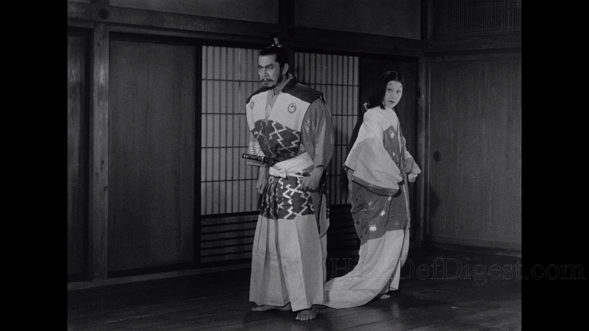
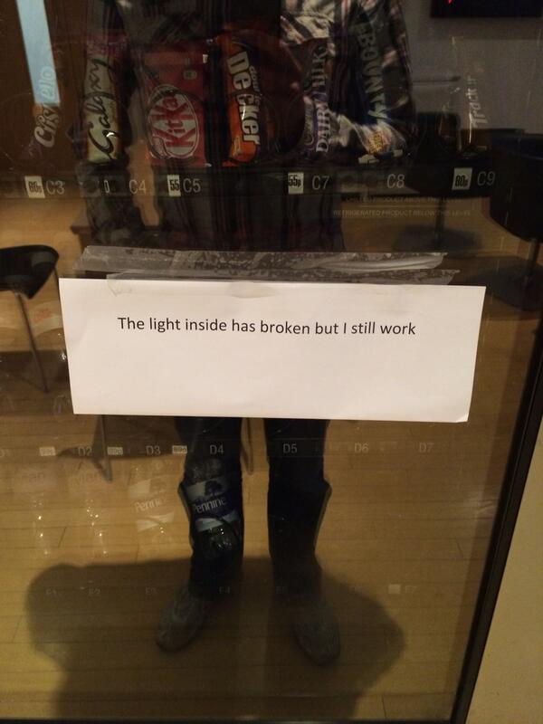

# Approaches to Emotion

All right, so today we're starting some approaches to understanding emotion. But first, a reminder that the first reaction paper is due on the 25th.

So, it looks like I was wrong, and the class is majority juniors! Rest of the survey questions are basic as all hell. Also, our professor is a runner, so we should all join her for one.

So, there are 3 main questions for us to consider:

* What is an emotion?
* How do we consider the full range of affective phenomena? (Including emotion)
* What are the main ways of thinking about emotion?

## What is an Emotion?

At its broadest level, life has 2 fundamental themes:

* *Action* - Things you do to survive and adapt; to plan for the future
* *Meaning* - Undertanding why things happen and how the world works, helps us aid in our actions.

Emotion is very important to understanding both of those things. At their broadest level, they're a label we slap on certain physiological responses, which is why being excited is so often confused with being nervous. Many of these nuanced emotion labels are culturally specific, which is why so many things the Japanese consider fun seem amazingly boring to an American audience.



...See, they were having such a good time and they didn't even finish the saucisson-wait, wait, I'm getting my stuff mixed up.

Anyhow, official definition! The authors of our textbook say that an emotion is:

>"A psychological state that mediates between our concerns and the world of events"

### Local Rationality

It's no secret that emotions mess up rational decision making, so then, why do we still have them? Many psychologists believe that in a world that isn't rational, the irrationality of our emotions act as a counterbalance to whatever irrational event just happened. Unfortunatley, as the world becomes more and more rational, this is starting to pose a problem. But emotions remain rational within the small local sphere in which they happen.

The definition of emotion remains a constant source of disagreement to psychologists.

### The Modal Model

This model, proposed by Gross and Thompson in 2007, posits that emotions arise when we attend to situations and see them as relevant to some goal we have. Situations we have no engagement with generate no emotion. While they're whole body experiences, they involve looseley coupled changes in subjective experience, behavior and bodily function.

This definition caught some flak for focusing on physiological changes and subjective things like behavior, both of which lay in the domains of endocrinology and behaviorism/cognitive science, respectively.

One of the lynchpins of the model is what's known as the "response frequency". Essentially, a situation happens, there's a few second delay, and then a multisystem response kicks off that expresses the emotion This reaction is quick (seconds) to peak and slow to level off back to neutral.

### The Emotion Generation Cycle

The cycle has 5 main parts:
* Situation happens
* We give it attention
* We appraise it
* Our system responds
* Our response causes more situations

## Affective Phenomena

An affect is any state involving good-bad impulses:
 
### Stress

This is all too familiar to all of us; the inability to cope with percieved demands, usually negative.

### Emotions

Short-lasting responses to specific objects or events. They can be positive or negative, but they almost always bias our actions.

### Mood

Longer lasting than emotions, these are not discrete emotional states, but rather emotional states that bias *cognition*, not action. The same event can trigger vastly different emotions depending on mood.

Moods are also not tied to specific events, and as a result can be very difficult to find the cause of, or snap out of once we know.

...This should sound familiar.

### Impulses

These are unpleasant reactions that don't bias actions as much as they provide a clear action and force you to do it. 

These all have vastly different timescales. Expressions and implulses can last for seconds, self-reported emotions take minutes or hours, moods can last anywhere from hours to months, and when a mood gets too long, it can become an emotional disorder, which can last for years. Once a mood lasts an entire lifetime, we just start calling it a personality trait.



I know how you feel, Halligan vending machine.

## Discrete and Dimensional Approaches

Another distinction people make is one between these 2 kinds of emotion. The discrete approach is that emotions are all different, happiness is different from sadness is different form anger, etc. The dimensional approach posits that all these discrete emotions can be explained by vectors in 2 or 3 superordinate dimensions, usually activation and arousal. Take a look:

```
            ACTIVATION
                 |
                 |
                 |
UNPLEASANT---------------PLEASANT
                 |
                 |
                 |
           DEACTIVATION
```

So lethargy might be in Quadrant 3, but content might be in Quadrant 4.
